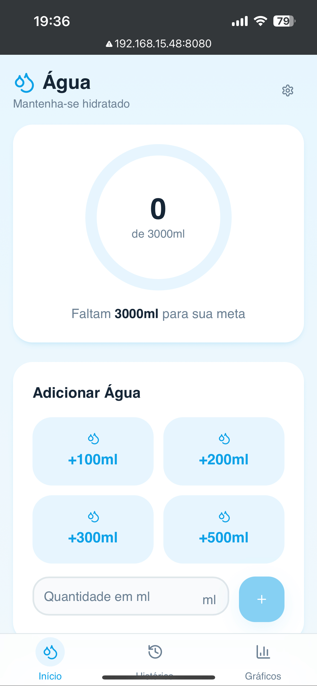
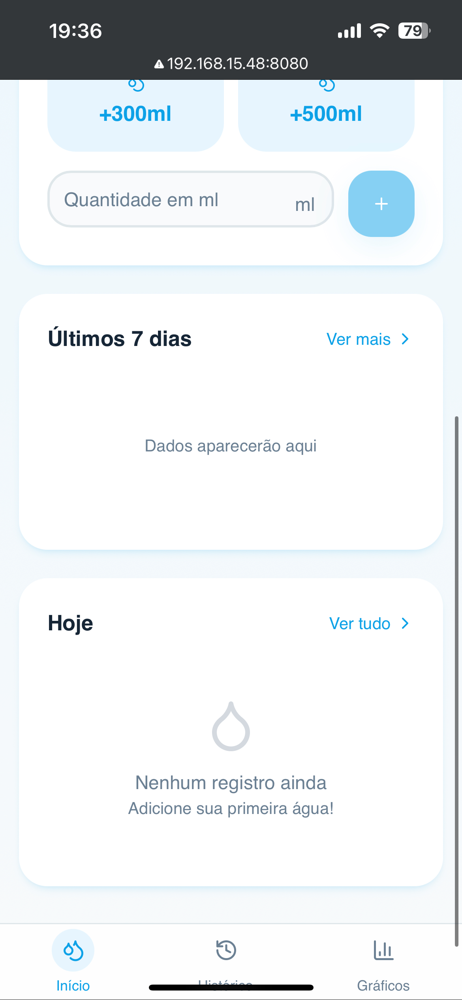
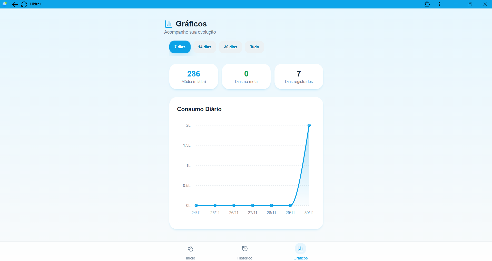
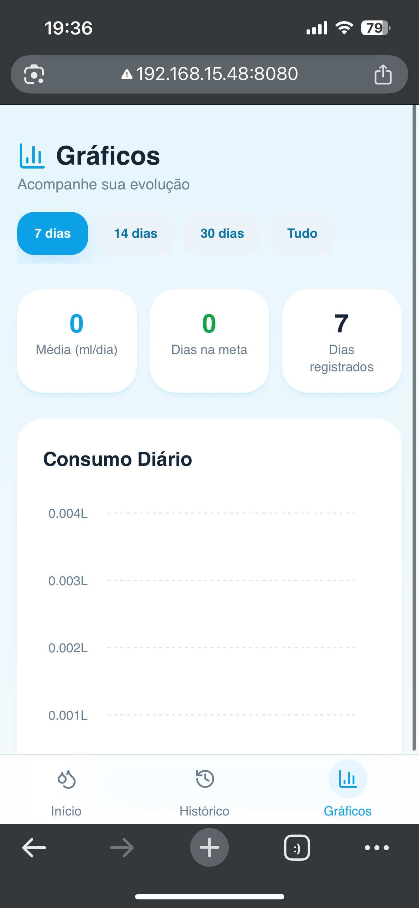
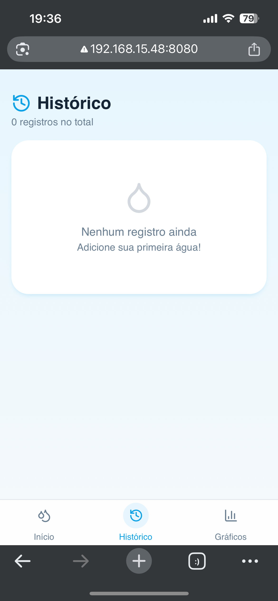

# 💧 Hidra+

### **Autores**
- 👤 **Guilherme de Deus Pereira Gomes** (https://github.com/guilhermededeus)
- 👤 **Vinicius Oliveira Silva** (https://github.com/Devniciusilva)

---

## 📌 1. Descrição do Problema

A hidratação adequada é essencial para o funcionamento saudável do corpo humano. No entanto, muitas pessoas não conseguem acompanhar seu consumo diário de água, o que pode resultar em fadiga, dor de cabeça, redução do desempenho cognitivo e aumento do risco de doenças crônicas.

A ausência de ferramentas simples e acessíveis para registrar e monitorar a ingestão hídrica é um fator que contribui diretamente para esse problema. Dessa forma, surge a necessidade de um aplicativo prático, intuitivo e eficiente para auxiliar na manutenção desse hábito saudável.

---

## 📌 2. Justificativa — ODS Relacionado

Este projeto está alinhado ao **ODS 3 — Saúde e Bem-Estar**, buscando promover hábitos saudáveis e incentivar o autocuidado diário.

**Meta relacionada:**  
- **ODS 3.4:** Reduzir doenças crônicas não transmissíveis por meio da promoção da saúde, da prevenção e do acompanhamento de comportamentos saudáveis.

O Hidra+ contribui diretamente para essa meta ao possibilitar o acompanhamento e o controle da ingestão de água, estimulando uma rotina de bem-estar e manutenção da saúde.

---

## 📌 3. Público-Alvo

O aplicativo é destinado a:

- Estudantes  
- Trabalhadores com rotina intensa  
- Pessoas que buscam melhorar hábitos de saúde  
- Usuários que desejam acompanhar metas diárias  
- Indivíduos que precisam desenvolver disciplina em autocuidado  

O público-alvo inclui qualquer pessoa que deseje melhorar sua qualidade de vida por meio de um monitoramento simples e eficiente de hidratação.

---

## 📌 4. Objetivos do Aplicativo

### 🎯 **Objetivo Geral**
Oferecer uma ferramenta simples, elegante e acessível para registrar e acompanhar a ingestão diária de água.

### 🎯 **Objetivos Específicos**
- Registrar manualmente a quantidade de água ingerida  
- Definir uma meta personalizada diária  
- Exibir histórico completo, incluindo data e horário  
- Gerar gráficos comparativos entre diferentes dias  
- Permitir remoção de registros inseridos incorretamente  
- Funcionar como um PWA instalável, tanto no mobile quanto no desktop  

---

## 📌 5. Tipo de Aplicação

O **Hidra+** é um **PWA (Progressive Web App)** desenvolvido com:

- **React + Vite**
- **TypeScript**
- **TailwindCSS**
- **Vite Plugin PWA**
- **LocalStorage** para persistência de dados

### 🔎 O que é um PWA?

Um PWA é um aplicativo que funciona no navegador, mas pode ser **instalado no celular ou desktop** como se fosse um app nativo.  
Ele oferece:

- Execução offline  
- Instalação direta pelo navegador  
- Interface em tela cheia (standalone)  
- Performance elevada  

---

## 📌 6. Instalação e Uso

### ✔ Instalação no Celular (Android)

1. Acesse o link do aplicativo no navegador (Chrome recomendado)  
2. Toque em **“Adicionar à tela inicial”**  
3. Confirme  
4. O app ficará disponível como um aplicativo comum  

### ✔ Instalação no Desktop (Windows/macOS/Linux)

1. Acesse o aplicativo no Chrome ou Edge  
2. Clique no ícone de **instalação de PWA** na barra de endereços  
3. Confirme a instalação  
4. O app abrirá em modo janela  

### ✔ Como Usar

- Insira a quantidade de água ingerida  
- Acompanhe o progresso frente à meta  
- Consulte o histórico completo  
- Visualize gráficos por dia  
- Delete entradas feitas por engano  

---

## 📌 7. Requisitos do Sistema

### ✔ Navegadores Compatíveis
- Google Chrome (recomendado)  
- Microsoft Edge  
- Safari (iOS 16+)  
- Firefox (parcial, sem instalação PWA)  

### ✔ Execução Local
- Node.js 18+  
- npm 9+  
- Vite 5+  

### ✔ Dispositivos Compatíveis
- Android 8+  
- iOS 16+  
- Windows 10+  
- macOS / Linux  

---

## 📌 8. Executando Localmente

### Clonar o Repositório
```bash
git clone <URL-do-seu-repositorio>
cd hidra+
```

### Instalar Dependências
```bash
npm install
```

### Rodar o Servidor de Desenvolvimento
```bash
npm run dev
```

### Gerar Build de Produção
```bash
npm run build
```

## 📌 9. Estrutura Geral do Projeto

```
hidra+/
 ├── public/
 ├── src/
 ├── screenshots/
 ├── index.html
 ├── package.json
 ├── vite.config.ts
 ├── tailwind.config.ts
 ├── tsconfig.json
 └── README.md
```

## 📌 10. Screenshots

### 🖥️ Tela Inicial – Desktop
<p align="center">
  
</p>

<p align="center">
  
</p>

---

### 📱 Tela Inicial – Mobile
<p align="center">
  
</p>

<p align="center">
  
</p>

---

### 🖥️ Tela do Gráfico – Desktop
<p align="center">
  
</p>

---

### 📱 Tela do Gráfico – Mobile
<p align="center">
  
</p>

---

### 🖥️ Tela de Histórico – Desktop
<p align="center">
  
</p>

---

### 📱 Tela de Histórico – Mobile
<p align="center">
  
</p>

## 📌 11. Referências
- [ONU – Objetivos de Desenvolvimento Sustentável](https://brasil.un.org/pt-br/sdgs)
- [ABNT NBR ISO/IEC 25010](https://www.abntcatalogo.com.br/norma.aspx?ID=413211)
- [React Documentation](https://react.dev/)
- [Vite Documentation](https://vitejs.dev/)
- [TailwindCSS Documentation](https://tailwindcss.com/)
- [Google Material Design](https://m3.material.io/)


## ✔ Conclusão
O Hidra+ promove o bem-estar ao incentivar a hidratação adequada de maneira simples, elegante e acessível. Sua estrutura como PWA permite que qualquer usuário utilize o aplicativo tanto no navegador quanto instalado em seu dispositivo, reforçando sua utilidade prática e impacto positivo dentro do contexto dos Objetivos de Desenvolvimento Sustentável.
 

 
